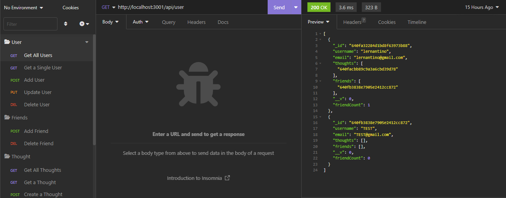
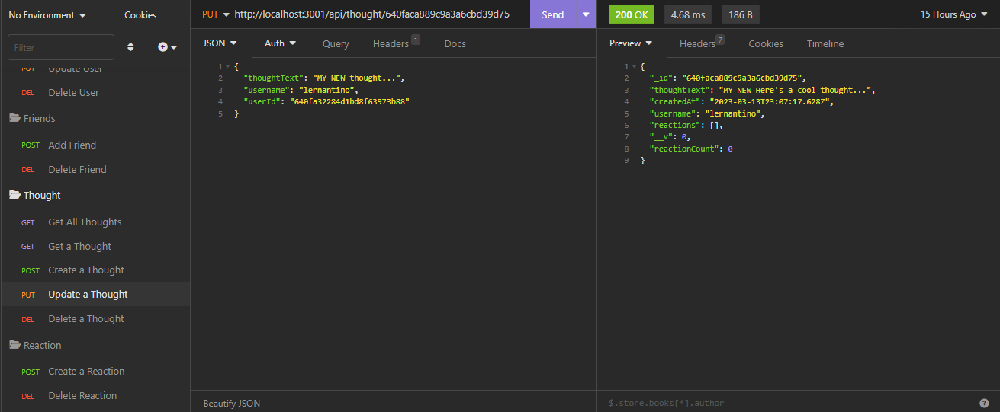

# Mod 18 - Social Network API

## Description

The following challenge involved creating the backend routes, models, and controllers for a social network. The application does include any frontend framework, but rather an API. The current features include:

-	See all or one user
-	Create a user
-	Update a user
-	Delete a user & associated thoughts
-	Add a friend
-	Delete a friend
-	See all or one thought
-	Create a thought
-	Update a thought
-	Delete a thought
-	Add a reaction
-	Delete a reaction

Link to Video of Application: https://www.loom.com/share/1198638035f24d1a83e713908971800e

## Installation

Please install libraries and run on a console. Repo does not include any seed data.

The application will be invoked by using the following command:

node index.js

## Technologies Used

- Node.js
- Express.js
- MongooseDB
- Mongoose ODM

## License

none
